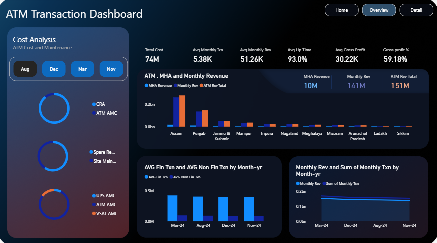
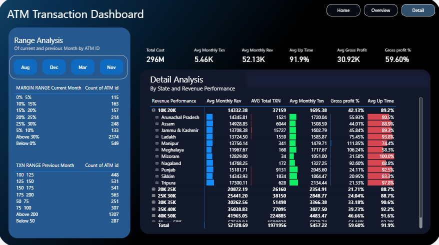

# ATM Transaction Analysis Dashboard

> An interactive Power BI dashboard designed to analyze ATM transaction activity, revenue, operating costs, profitability, and operational performance.

---

## Business Problem

ATM networks generate large volumes of transaction and operational data, but raw transaction records can make it difficult to understand overall performance.

This project focuses on using data analytics and business intelligence to answer questions such as:

- How are ATM transactions changing over time?
- How much revenue is generated across different periods and locations?
- What are the major components of ATM operating costs?
- Which states or ATM groups show stronger financial performance?
- How does transaction volume relate to revenue?
- Which ATMs fall into different profitability ranges?
- How does ATM uptime vary across the network?

The objective is to transform transaction and operational data into an interactive dashboard that allows users to monitor performance and identify areas requiring attention.

---

## Dashboard Overview

The dashboard is organized into three main sections:

### 1. Home

The landing page provides an overview of the project and navigation to the analytical sections.

### 2. Overview

The Overview page provides a high-level view of ATM network performance through:

- Total Cost
- Average Monthly Transactions
- Average Monthly Revenue
- Average Uptime
- Average Gross Profit
- Gross Profit %

It also includes analysis of:

- Cost composition
- Revenue performance
- Financial and non-financial transactions
- Monthly transaction trends
- Monthly revenue trends
- State-level performance

### 3. Detail Analysis

The Detail page provides a more granular view of ATM performance.

It includes:

- State-level performance analysis
- Revenue metrics
- Transaction metrics
- Gross profit percentage
- ATM uptime
- Margin range analysis
- Transaction range analysis
- Detailed ATM/state-level performance tables

---

## Key KPIs

The dashboard tracks several business performance indicators:

| KPI | Purpose |
|---|---|
| Total Cost | Measures overall operating expenditure |
| Average Monthly Transactions | Tracks transaction activity |
| Average Monthly Revenue | Measures average revenue generation |
| Average Uptime | Monitors ATM availability |
| Average Gross Profit | Measures profitability |
| Gross Profit % | Evaluates profitability relative to revenue |

---

## Analysis Performed

### Transaction Analysis

The dashboard analyzes transaction activity across time and separates:

- Financial Transactions
- Non-Financial Transactions

This helps identify changes in ATM usage and transaction behavior.

### Revenue Analysis

Revenue performance is analyzed across monthly periods and states to identify variations in ATM-generated revenue.

### Cost Analysis

Operating costs are analyzed through different cost categories, including maintenance-related expenses.

### Profitability Analysis

ATMs are evaluated using gross profit and gross profit percentage.

Performance ranges are used to identify groups of ATMs with different profitability levels.

### Operational Performance

ATM uptime is analyzed to understand network availability and operational reliability.

---

## Dashboard Features

- Interactive month-based filtering
- State-level analysis
- ATM-level performance analysis
- KPI cards
- Revenue and transaction trend analysis
- Cost breakdown
- Profitability analysis
- Margin range analysis
- Transaction range analysis
- Drill-down/detail views
- Conditional formatting for performance metrics
- Multi-page Power BI navigation

---

## Dashboard Preview

### Home Page


### Overview



### Detail Analysis



---

## Tools & Technologies

- **Power BI**
- **Power Query**
- **DAX**
- **Microsoft Excel / CSV**
- Data Cleaning & Transformation
- Data Visualization
- Business Intelligence
- KPI Analysis

---

## Project Workflow

```text
Raw Data
   ↓
Data Cleaning & Transformation
   ↓
Data Modeling
   ↓
DAX Measures & KPIs
   ↓
Exploratory Analysis
   ↓
Dashboard Design
   ↓
Interactive Visualizations
   ↓
Business Insights
